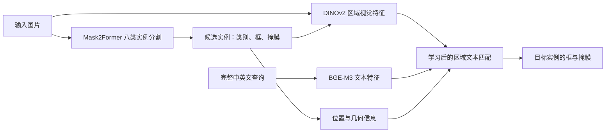

# 自然语言引导的八类服饰实例分割

**图片 + 一句服饰描述 → 指定整件服饰的类别、框和掩膜。** 例如，在有两个包的图片里输入“左边的包”，系统应该选中左侧的那个包，并标出它的轮廓。

这是 COMP 4471 / ELEC 4240 的三人课程项目。分工尚未确定。仓库先公开，供队友阅读；后续可按团队决定改为私有。

> 当前交付的是项目启动工程和说明文档。数据转换、训练、语言匹配、评估与演示代码尚未实现，没有本次课程的新实验结果，也没有可直接运行的训练命令。

## 队友从这里开始

| 顺序 | 阅读内容 | 读完应能回答的问题 |
| --- | --- | --- |
| 1 | [项目完整讲解](docs/project_guide.md) | 做什么，为什么做，模型如何配合，最后展示什么？ |
| 2 | [模型结构与训练方法](docs/technical_design.md) | 模型内部怎样工作、哪些参数训练、损失怎么定义？ |
| 3 | [数据转换与查询标注](docs/data_protocol.md) | 具体源类别怎么映射、缺标注怎么处理、查询怎么复核？ |
| 4 | [工程模块与实现接口](docs/implementation_spec.md) | 每个模块接收什么、输出什么、如何检查实现？ |
| 5 | [实验设计与评估规则](docs/experiment_plan.md) | 比较哪些条件、怎样分解漏检与选错、如何测延迟？ |
| 6 | [课程要求](docs/course_requirements.md)、[协作说明](docs/team_workflow.md) | 何时交付、如何协作和记录结果？ |
| 7 | [英文 Proposal 草稿](docs/proposal.md) | 如何向教师提出研究问题和方法？ |

首次讨论可先用 15–20 分钟阅读讲解和流程图，再按技术文档核对模型、数据与实验。负责人留待讨论后填写。

## 范围和主要方法

八类是上衣、裤子、裙子、外套、连衣裙、鞋子、包包和配饰。核心任务处理**单条中英文描述所指向的一件完整实例**；口袋、领口等服饰部件定位不在首阶段范围内。

Mask2Former 负责找到服饰实例；语言模块负责从候选中选出描述所指的实例。先完成类别与位置规则基线，再训练区域文本对齐或排序模块。DINOv2 和 BGE-M3 是候选编码器，其原始向量不能直接当作已经对齐的视觉语言特征比较。

具体方案是 DINOv2 384 维 mask 区域特征与 BGE-M3 1024 维完整查询，分别经可学习 MLP 投影到 256 维，用同图实例排序交叉熵训练；L3 增加 12 维几何及文本条件空间头。核心研究比较是区域文本学习和空间输入是否改善同类歧义选择，而非仅判断文字里的类别。

数据方面，DeepFashion2 没有鞋、包、配饰标注，直接混合八类会产生错误负监督。以 Fashionpedia 八类为安全基线，再比较普通混合训练与拟实现的 source aware partial label loss。全部方法、参数和风险见[模型设计](docs/technical_design.md)。

以公开数据、公开实现和公开预训练权重为起点，重新完成课程数据处理、微调和实验。此前的实习经验作为选题背景；旧代码和旧实验结果没有导入本仓库。论文、基础代码与权重均需在报告中注明来源。

## 工程文件

| 路径 | 用途 | 当前状态 |
| --- | --- | --- |
| [docs/](docs/) | 讲解、要求、Proposal、实验与协作说明 | 已整理 |
| [configs/categories.json](configs/categories.json) | 八类名称和项目标签 ID | 标签已定义 |
| [configs/source_category_mapping.json](configs/source_category_mapping.json) | 两源所有 59 个类别 ID、映射与排除规则 | 源 ID 已查证；项目映射待团队审查与实现 |
| [configs/training_plan.json](configs/training_plan.json) | 网络维度、损失、超参数、采样与评估起始值 | 设计配置；不是可运行训练配置 |
| [configs/project.json](configs/project.json) | 项目范围、平台建议和截止日期 | 规划配置，不是训练配置 |
| [examples/](examples/) | 查询标注和预测输出的格式示例 | 人工示例，不是模型结果 |
| [experiments/registry.csv](experiments/registry.csv) | 实验登记、配置和指标索引 | S1–S4、L1–L5 均未运行；负责人空白 |
| data/raw/、data/processed/ | 本地数据目录 | 只有目录占位文件 |
| models/、outputs/ | 本地权重与运行输出目录 | 只有目录占位文件 |

原始图片、处理数据、模型权重、训练输出和凭据不上传 GitHub；共享数据与权重的位置在团队确定后记录。后续训练入口、依赖锁定和小规模检查通过后再添加实际运行说明。

## 平台和下一步

建议在 AutoDL 普通容器实例上使用一张 RTX 3090 24GB，按量计费；GPU 尚未租用，环境和显存尚未验证。先检查公开实现兼容性、数据访问与小批量训练，再决定正式预算。平台设置见[协作说明](docs/team_workflow.md)。

近期先确认范围、填写三名成员信息并定稿 Proposal。**Proposal 截止：2026 年 10 月 5 日 23:59，香港时间。** Milestone 为 11 月 6 日，Final report 为 12 月 5 日；详细要求见[课程要求](docs/course_requirements.md)。
