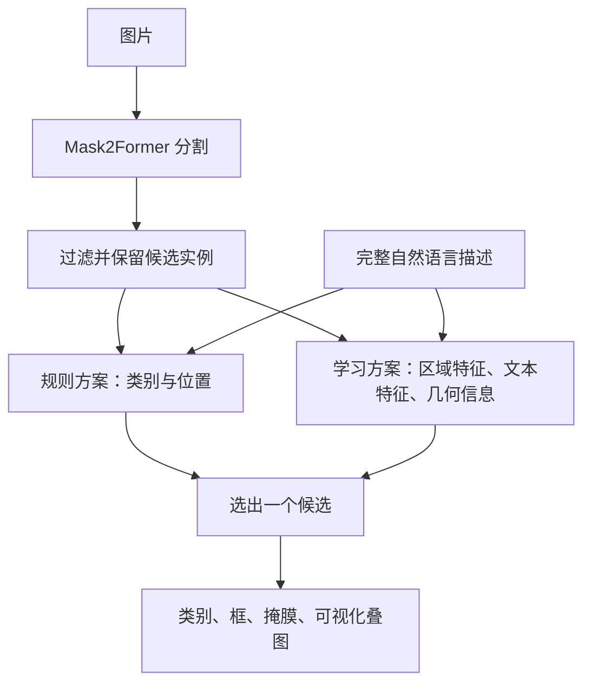

# 项目完整讲解：从图片分割到自然语言选中服饰

这份说明供三位成员第一次讨论时使用。当前所有模型训练和新实验均待执行；文中的例子是任务说明，流程和公式是拟采用的方法。

## 1. 我们究竟要做什么

用户上传一张服饰图片，再输入一句话，例如“左边的包”。系统先识别图片中有哪些服饰实例，再选择这句话描述的目标，返回目标的类别、矩形框和逐像素轮廓。

假设图片中有一件上衣、一条裙子和两个包。普通八类实例分割可以给出四个候选，却不知道用户想要哪个包。自然语言模块把“包”和“左边”结合起来，选择左侧的那个实例。若输入“红色的裙子”，它需要结合类别和可见外观，而不能仅凭关键词“裙子”就宣称理解了颜色。

| 概念 | 本项目里的含义 | 例子 |
| --- | --- | --- |
| 分类 | 判断属于哪个类别 | 这是一个包 |
| 检测 | 用框标出物体位置 | 包在图片左侧的矩形区域 |
| 语义分割 | 为像素指定类别，通常不区分同类个体 | 两个包的像素都标为 bag |
| 实例分割 | 为每个物体分别输出轮廓 | 左包和右包是两个独立 mask |
| 自然语言定位 / grounding | 把描述对应到具体目标 | “左边的包”对应左包的实例 ID |

我们的最终任务是**自然语言引导的实例选择与掩膜输出**。核心范围是整件物体、单条描述、单个明确目标。部件如“上衣的口袋”、多目标如“所有包”、复杂关系如“站在第二个人旁边的人穿的外套”，以及无目标查询的可靠拒绝机制，均不作为首阶段承诺。

“左”和“右”以图片视角为准。含糊的描述如两个包都符合“那个包”要进入人工复核，不能硬指定任意一个为正确答案。

## 2. 为什么适合作为课程项目

项目对应课程的应用方向：使用已有深度学习方法解决实际问题，并通过数据处理、方法实现和对照实验给出证据。使用公开 Mask2Former 并不等于项目已经完成；团队的工作还包括八类数据统一、实例描述标注、区域文本学习、实验复现和错误分析。

我们希望回答三个研究问题：

1. 混合 DeepFashion2 与 Fashionpedia 后，八类覆盖和各数据集的分割表现如何变化？
2. 学习后的区域文本匹配，是否比类别与位置规则更擅长处理外观描述和同类多实例？
3. 分辨率、推理精度、特征缓存和空间信息如何影响效果与速度？

这些是待验证的问题，不预先假定一定提高。只有框架演示、没有明确比较和结果解释，难以体现课程对方法与实验的要求。课程没有给出必须达到的 AP、准确率或延迟数字；此前实习中的业务指标不作为课程验收门槛。

## 3. 与此前实习工作的关系

已有实习经验提供了服饰数据、实例分割与语言定位的背景。本次三人重新完成公开数据处理、课程实现、微调、实验和报告，使用公开预训练模型作为初始化。本仓库没有导入实习源代码、旧训练权重、旧日志或旧性能数字。

报告要明确引用借鉴的论文、公开代码和权重；课程贡献写本次实际完成的内容。规划中的模块不能写成已完成，旧经验也不能替代新课程实验。

## 4. 系统如何运行



### 第一步：找到所有服饰候选

Mask2Former 是现成的分割架构，可以用于实例分割。拟以 R50 版本的公开预训练权重开始，修改类别设置，按统一八类标注微调。输出每个实例的类别、置信度、框和 mask；类别置信度表示分割模型的判断，不是语言选择成功率。

候选数、分割阈值、输入尺寸和过滤规则要固定到配置里。如果目标在这里已经漏掉，后面的语言选择模块就无法恢复其掩膜；因此端到端误差必须同时检查候选召回和匹配能力。

### 第二步：先实现规则基线

对于“左边的包”，先识别查询中的类别 bag，再在候选包中比较框中心的横坐标，选择最左侧实例。中英文类别和简单方位词用明确词表支持；不支持的词语和多解查询记录为失败或待处理，不偷偷忽略修饰词。

规则方案便于检查数据流，也提供一个基线。如果唯一候选已经确定，学习模型的成功不能被当作处理歧义的证据；要单独统计同类多实例查询。规则不理解的颜色、图案等描述也需要保留在对比评估中，明确报告其支持范围。

### 第三步：学习图像区域与文本之间的匹配

拟使用冻结的 DINOv2 提取候选区域视觉特征，冻结的 BGE-M3 提取完整中英文描述的文本特征，然后训练较小的投影或排序模块。可以先提取全图的 DINOv2 特征，再在实例 mask 覆盖的区域池化；这通常比对每个候选重复编码整图更便于缓存，实际方式需在实现时确定并记录。

二者来自不同训练目标，原始特征的维度和含义不同。**不能把未经训练的 DINOv2 与 BGE-M3 向量直接做余弦相似度就称为完成视觉语言对齐。** 设视觉特征为 vᵢ、文本特征为 t，先训练投影：

```text
zᵢ = normalize(Pᵥ(vᵢ))
u  = normalize(Pₜ(t))
sᵢ = cosine(zᵢ, u) / τ
P(target=i | image, query) = softmax(s)ᵢ
loss = -log P(target=k | image, query)
```

k 是人工标注的目标实例，τ 是在开发集上选择或训练的温度参数。训练时同图其他实例提供负例，尤其需要同类别负例，避免模型只记住“包”和“裙子”的区别。

L3 再将候选的归一化框坐标、中心、面积等几何特征输入一个训练的排序模块，并与文本信息组合。“左边”属于空间概念，仅把物体裁剪出来可能丢失它在全图中的位置，因此需要与 L2 做消融比较。具体层数、损失实现和空间融合方式在小规模检查后锁定。

### 第四步：返回结果

选中候选后，返回实例 ID、类别、框、mask 文件或编码，以及可视化叠图。匹配分数用于候选排序，未做校准前不展示成“正确概率”。没有候选、模型失败和模糊描述都要保留状态，不伪造一个正常结果。

## 5. 数据从哪里来，八类怎样统一

使用 [DeepFashion2](https://github.com/switchablenorms/DeepFashion2) 与 [Fashionpedia](https://github.com/cvdfoundation/fashionpedia) 的官方数据及标注，遵守各自的获取方式和使用条件。DeepFashion2 主要覆盖服装类别；Fashionpedia 还提供鞋、包和配饰。两者标注粒度和类别体系不同，映射必须经过实际审查。

| 项目标签 | 中文 | 拟映射的整件物体范围 |
| --- | --- | --- |
| top | 上衣 | 衬衫、T 恤、背心等上装 |
| pants | 裤子 | 长裤、短裤等 |
| skirt | 裙子 | 半身裙 |
| outerwear | 外套 | 外套、夹克等；与 top 的边界需固定 |
| dress | 连衣裙 | 连衣裙，区别于单独半身裙 |
| shoes | 鞋子 | 数据集标注的鞋实例；单鞋与一双的粒度需审查 |
| bag | 包包 | 包类实例 |
| accessory | 配饰 | 实际纳入的整件配饰需列举，不能把所有剩余类别自动归入 |

这里只定义目标语义，**尚不是可执行的源类别映射表**。映射实现应逐项列出源类别 ID、目标 ID、是否排除及理由；不会把口袋、袖子等部件当成独立整件服饰。标签 ID 见 [categories.json](../configs/categories.json)。

语言训练还需要“图片 + 描述 + 目标实例”记录。位置描述可从标注生成后人工复核；颜色、图案和材质不能仅凭类别猜测。最初可先完成类别、方位和可靠颜色描述，再决定是否扩大类型。

```text
图片划分并冻结 → 在各自划分中生成描述 → 人工检查 → 模型训练 / 开发比较 / 最终测试
```

同一张图片生成的中文、英文和改写都属于同一个划分。保留官方训练与验证边界，进一步检查可追踪的近重复和同商品图片。最终测试集不用于模型选择。

[查询记录示例](../examples/query_record.json) 演示字段约定，其中 ID 和文字均为人工示例。真实图片与实例需要由数据转换程序建立；示例不可用于训练或当作标注完成量。

## 6. 怎样证明系统有效

分割用 COCO mask AP 和各类 AP 衡量；语言模块用目标选择准确率、最终目标 mask IoU、IoU ≥ 0.5 的成功率衡量。另按中文、英文、方位、外观、同类多实例分类统计。

同一组语言方法需要在两种候选上比较：

- **真实标注候选**：候选正确且完整，用来检查文字匹配能力。
- **模型预测候选**：实际用户流程，用来衡量漏检、轮廓误差和选错目标共同导致的结果。

前者是诊断，不能代替后者。端到端测试需固定分割权重与候选规则后比较语言方法。S1–S3 和 L1–L3 的控制变量与指标定义见[实验计划](experiment_plan.md)，均未运行。

延迟拆成分割、图片特征提取、文字编码和匹配。第一次处理图片与缓存后连续查询的响应要分开报告；记录 GPU、软件版本、输入尺寸、候选数、预热、GPU 同步和重复次数。三种模型加在一起是否能同时放进 24GB 显存需要测量，可分阶段加载或离线缓存。

报告至少展示成功和失败案例，例如：小配饰漏检、上衣与外套混淆、两个相似包选错、颜色描述失配、中文与英文表现差异。负结果也有分析价值。

## 7. 我们要完成哪些工程模块

| 模块 | 具体交付 | 完成时应能验证什么 | 负责人 |
| --- | --- | --- | --- |
| 环境与配置 | 依赖版本、配置、运行说明 | 新实例可完成小批量训练和推理 | 待定 |
| 数据处理 | 映射、统计、图片划分、数据清单 | 八类语义一致且无已知划分泄漏 | 待定 |
| 查询标注 | 中英文描述与目标 ID、复核记录 | 每条核心查询明确指向一个真实实例 | 待定 |
| 分割 | 微调、预测与 S 系列实验 | 固定集合上的分割指标可复现 | 待定 |
| 语言选择 | 规则、学习匹配、空间融合与 L 系列实验 | 同候选下的比较可复现 | 待定 |
| 评估与演示 | 指标、延迟、可视化与演示入口 | 输入图片与文字，得到可检查的目标结果 | 待定 |
| 报告 | Proposal、Milestone、Final 与引用 | 论点有数据支持，满足课程格式 | 待定 |

最小可用版本是“数据加载 → 分割候选 → 规则选择 → 叠图”。课程核心实验再加入学习匹配和空间消融。公开模型并非全都从头训练：拟微调分割模型、冻结两个编码器并训练匹配参数，控制三人团队的计算成本。

## 8. 第一次向队友讲解的顺序

1. 用“两个包，选左边那个”的例子解释输入与输出。
2. 对照流程图说明分割负责找实例，匹配负责选实例。
3. 说明八类数据来自两个公开数据集，查询需要团队生成并复核。
4. 展示规则、学习匹配和空间特征三种方案，说明它们为什么要比较。
5. 展示最终演示和实验表会长什么样，强调现在还没有新结果。
6. 读课程截止日期，确认 Proposal 范围；具体负责人之后再讨论。

队友读完后应能说明：目标是什么，三个模型各负责什么，哪些参数需要训练，为什么需要查询标注，以及如何区分“分割没找到”与“文字选错了”。

## 9. 主要阅读资料

- [Mask2Former 论文](https://openaccess.thecvf.com/content/CVPR2022/papers/Cheng_Masked-Attention_Mask_Transformer_for_Universal_Image_Segmentation_CVPR_2022_paper.pdf) 与 [官方实现](https://github.com/facebookresearch/Mask2Former)：分割架构和预训练使用方式。
- [DeepFashion2](https://github.com/switchablenorms/DeepFashion2) 与 [Fashionpedia](https://github.com/cvdfoundation/fashionpedia)：类别、标注粒度、数据访问与评估。
- [DINOv2](https://github.com/facebookresearch/dinov2)：视觉特征提取。
- [BGE-M3](https://huggingface.co/BAAI/bge-m3)：多语言文本编码。
- [课程项目要求](https://course.cse.ust.hk/comp4471/project.html)：应用方向与报告规范。

后续如引用别的论文、代码或权重，也同步加入报告的参考文献。具体实现和模型替换后，及时更新本文与 Proposal。
